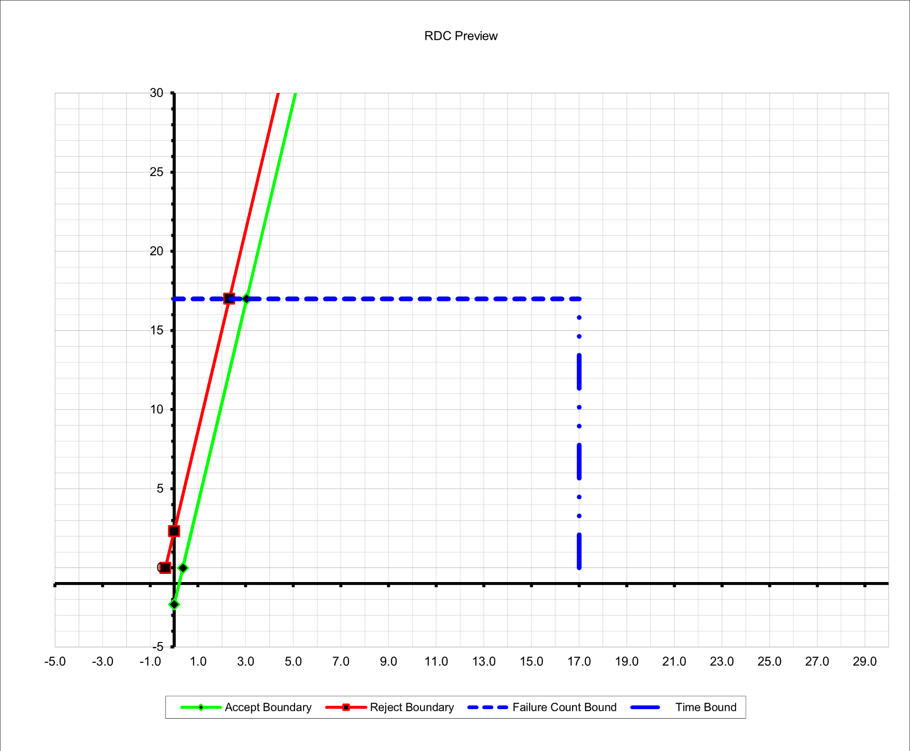

**SENG 637- Dependability and Reliability of Software Systems**

**Lab. Report #5 – Software Reliability Assessment**

| Group 19 |
|---|
| Sami |
| Mohammad |
| Ogechukwu |
| Emmanuel |

**Table of Content**

[Introduction](#introduction)

[Assessment Using Reliability Growth Testing](#assessment-using-reliability-growth-testing)

[Assessment Using Reliability Demonstration Chart](#assessment-using-reliability-demonstration-chart)

[Comparison of Results](#comparison-of-results)

[Discussion on Similarity and Differences of the Two Techniques](#discussion-on-similarity-and-differences-of-the-two-techniques)

[How the teamwork/effort was divided and managed](#how-the-teamworkeffort-was-divided-and-managed)

[Difficulties encountered, challenges overcome, and lessons learned](#difficulties-encountered-challenges-overcome-and-lessons-learned)

[Comments/feedback on the lab itself](#commentsfeedback-on-the-lab-itself)

# Introduction

In this lab report, we investigate different reliability assessment techniques, primarily two methods known as reliability growth testing and reliability demonstration chart methods to assess the quality of a system under test (SUT). The failure data for the SUT is provided and contains the following columns:

1. Time interval (T): the unit of time (assumed to be hours) over which the data is collected

2. Failure Count (FC): the number of defects detected during that time interval

3. Execution time (E): the amount of time spent running the system or executing tests to detect failures, measured in hours

4. Failure identification work (F): the human effort required to identify failures, measured in person-hours.

5. Computer time for failure identification (C): the amount of computer time required to identify failures, measured in hours.

In the following section, we will assess the reliability of the SUT with the failure data using the two methods.

# Assessment Using Reliability Growth Testing

For the reliability growth testing strategy, we chose to work with the C-SFRAT tool because we faced many problems with the SRTAT software, where some models could not be run. The analysis was carried out for all models available in the C-SFRAT software and the reliability estimations are shown in Figure 1.

*Figure 1: Reliability growth modelling with C-SFRAT tools experimenting across all models and covariate variables*

It shows the simulation using all the models alongside all the possible combinations of covariates. The figure illustrates the cumulative failure of the imported data and all the possible models in C-SFRAT. We can see that each model was run with no covariates (None), or with a combination of covariates (E, F, C).

To choose the best two models, we compared all the models and then chose the best two according to the Akaike information criterion (AIC) and Bayesian Information Criteria (BIC).  As shown in Figure 2, we have arranged the models in descending order according to AIC and BIC and chosen the best two models.  The best two models were DW3(F) and GM(F).

*Figure 2: Best two models with the lowest AIC and BIC metrics*

The two figures below show the cumulative failure and failure intensity with the two chosen models, respectively.

*Figure 3: Cumulative failure intensity plot with the two selected models (DW3(F) and GM(F))*

*Figure 3: Failure intensity plot with the two selected models (DW3(F) and GM(F))*

## Range analysis for selected models

For choosing the range analysis, we adopted the Laplace test. We calculated the Laplace factor and plotted the values as demonstrated in Figure 4.

*Figure 4: Laplace test on the imported failure data to analyse the range for projecting*

Negative values of the Laplace factor u(k) indicate a decreasing failure intensity, i.e., reliability growth, whereas positive values indicate an increasing failure intensity, i.e., reliability decrease. Therefore, we chose to take a subset consisting of the first 19 data points because the factor values are still negative, which means there is a reliability growth.

After we decided to continue analysis using the first 19 data points, we ran the two models to predict the cumulative failure for the rest of the time intervals, i.e. the intervals from 20 to 31, which were dropped after applying the Laplace test. The result is shown in Figure 5.

*Figure 5: Cumulative failure prediction with selected models*

We can notice that the models don’t fit the data anymore. Therefore, we decided to consider more data points as part of the analysis range. We used the time intervals 20 and 21 to make the models fit the data while considering the value of the Laplace factor for these intervals. The Laplace factor is not negative for the 20th or 21st intervals, but it is still between -2 and 2, so it is acceptable to take these points since the reliability growth is considered stable then. In conclusion, the range of data taken for analysis is the time interval from 1 to 21.

## Plots for failure rate and reliability of the SUT for the test data provided

For the subset of 21 intervals, and after tuning the value of the covariate F to equal 20, the models fit the data as shown in the following figure.

*Figure 6: Tuned models fit on failure data at F = 20*

Now after choosing the range of data we used for analysis, we plotted the cumulative failure (reliability) and failure intensity (failure rate) plots as follows.

*Figure 7: Cumulative failure intensity plot with the two tuned models (DW3(F) and GM(F))*

*Figure 8: Failure intensity plot with the two tuned models (DW3(F) and GM(F))*

## A discussion on decision-making given a target failure rate

Given a target failure rate (failure intensity), we can interpret from the models the additional time intervals required to reach this target value. In our case, if we want to have a target failure intensity equal to 0.3 for example, we can set the Failure Intensity Target in the C-SFRAT to this value as shown in Figure 9.

*Figure 9: Decision-making between the two models with a failure intensity target of 0.3*

We can notice from the figure that the GM model predicts that 59 additional time intervals are required to achieve the target intensity value. Whereas the DW3 predicts that no additional time intervals are required to achieve that value.

Setting a different target value of failure intensity, 2.5 for example, we get the result in the following figure:

*Figure 10: Decision-making between the two models with a failure intensity target of 2.5*

We can notice that the GM model predicts that 5 additional time intervals are required to achieve the target value. On the other hand, the DW3 model predicts that 6 additional time intervals are required to achieve the same value.

## A discussion on the advantages and disadvantages of reliability growth analysis

Reliability growth analysis is a very important tool used in engineering as well as product development to improve the reliability of systems over time. However, it has its advantages and disadvantages.

**Advantages:**

1. Identify weakness: Reliability growth analysis allows engineers to accurately pinpoint weaknesses in a product. By observing failure rates and patterns, engineers can identify specific components or areas that need improvement

2. Continuous improvements: Reliability promotes a culture for continuous improvements. It supports the systematic analysis of failure and corrective measures to mitigate and enhance incrementally improvement with time

3. Cost Saving: Improving reliability early in the development lifecycle can lead to more significant cost savings. Mas production or deployment companies can avoid and reduce expensive recalls and repairs when the system is detected early.

4. Customer satisfaction: Customers are more satisfied that the product is reliable. Companies can build brand loyalty, and gain a competitive edge when reliability is addressed into their satisfaction.

5. Risk Management: Risk due to product failures can be mitigated with reliability growth analysis. By analyzing and predicting trends and addressing potential failure modes, risks such as financial loss, brand reputation and safety can be minimized.

**Disadvantages:**

1. Resource Intensive: Reliability growth analysis requires substantial resources such as time, manpower, and expertise. For very complex systems gathering and analyzing reliable data can take a lot of time.

2. Complexity: It requires complex statistical techniques and models. Also interpreting the data and identifying the meaning of the trends almost requires experts in statistics. Also, such organizations are not prepared to hire and get such individuals.

3. Assumptions Dependency: Certain assumptions must be made to determine how accurate the reliability growth analysis present. Analysis like the constant failure rate and effectiveness of corrective actions. As such these assumptions must be followed and deviations can lead to incorrect analysis.

4. Limited Preductive Power: In most cases, reliability growth analysis provides insights into past performance and trends with limited predictive power in future reliability. Changes in operating conditions and usage patterns and technology advancements can influence the outcomes and such longer prediction can become a challenge.

5. Over-Reliance: Overly relying on the reliability growth analysis alone can lead to product reliability risk. As such it should it should be complemented with other reliability engineering techniques such as failure mode and effect analysis and field testing for comprehensive reliability assurance robust systems.

# Assessment Using Reliability Demonstration Chart

The reliability demonstration chart (RDC) is another assessment strategy for system reliability. It is the plot of the cumulative failure against the normalised failure time. The provided data for this lab has covariate data useful for reliability growth modelling as discussed in the previous sections, however, for the RDC, we would typically plot the cumulative number of failures (or failure rate) over time. Thus, the relevant parameters for the plot are the following:

1. T (Time interval): as the x-axis to show the passage of time.

2. FC (Failure Count): to calculate the cumulative failures or failure rates over time.

The tool chosen for the task is the Reliability-Demonstration-Chart.xls. It is an open-source tool for producing a reliability demonstration chart where the user inputs the failure data and risk parameters. The goal of an RDC is to measure the observed reliability against a desired reliability determined by risk parameters. The failure data is entered as the cumulative failure count and the time units for observations. The RDC plot is then generated with the normalized time units which are determined using the desired mean time to failure (MTTF) or failure intensity objective (FIO). In the provided data, there are 31 observations with a cumulative maximum of 92 failure counts. It was assumed that the time interval was given in hours such that the cumulative maximum of 92 failure counts is observed after 31 hours. Therefore the system fails 92 times after 31 hours which is a high failure rate. This inherently affected how the risk parameters were chosen to generate the condition boundaries (reject, continue and accept regions) (see Figure 12). Figure 11 shows the RDC plot after tweaking the risk parameters to attain a boundary that slightly matches the system's failure rate. The green area constitutes the accept region, the red area is the reject region and the yellow area is the continue region which determines whether a system is acceptable for release or not, or needs further testing. The risk parameters determine these boundaries. Three risk parameters need to be set and they are alpha (the developer’s risk), beta (the user’s risk) and gamma (discrimination ratio).

The developer’s risk (alpha) takes values between 0 and 1 (boundaries not inclusive) to set the *reject region*. In a more technical term, it is the chance that a satisfactory SUT is rejected. Similarly, the customer’s risk (beta) takes values between 0 and 1 (boundaries not inclusive) to set the *accepted region*. It is the chance that an unsatisfactory SUT is being accepted. Lowering these risk parameter values expands the *continued region* towards the northwest and southeast corners. Lastly, there is the discrimination ratio (gamma) that indicates the error in estimating the failure intensity objective (desired reliability). It takes values greater than 1 such that higher values result in a flatter slope indicating a lower acceptable failure rate and a higher reliability standard whereas lower values result in a steeper slope, therefore, indicating a higher acceptable failure rate and a lower reliability standard.

*Figure 11: Reliability Demonstration Chart at Failure Intensity objective set to 4 fails in 10 hours at risk parameters alpha=0.1%, beta=0.1% and gamma=20. Each normalised time unit equals 2.5 hours.*

*Figure 12: Decision boundaries with set risk parameters (RDC preview) at a slope of 6.342*

The following plots will be examined as a complete analysis of the reliability assessment of the SUT using the RDC strategy

1. RDC plot with the minimum MTTF that makes the SUT acceptable

2. RDC plot with the MTTF set to twice the minimum MTTF

3. RDC plot with the MTTF set to half the minimum MTTF

## RDC plot with the minimum MTTF that makes the SUT acceptable

The minimum MTTF that makes the SUT acceptable is 7/4 (or 4 failures in 7 hours) as shown in Figure 13. It can be seen that the cumulative failure is conveniently in the green region. Here the minimum MTTF is lenient and accepts a high failure rate. Following the presets of risk parameters to attain steeper boundaries that match the high failure rate, as shown in Figure 12, we changed the value of the MTTF(or FIO) gradually to the value that makes the SUT acceptable from 10/4 (4 failures in 10 hours) to 7/4 (or 4 failures in 7 hours). Thus the minimum MTTF or highest FIO that makes the SUT acceptable given that the actual MTTF is 15.46, is 7/4 for the selected risk parameters.

*Figure 13: Reliability Demonstration Chart at Failure Intensity objective set to 4 fails in 7 hours at risk parameters alpha=0.1%, beta=0.1% and gamma=20. Each normalised time unit equals 1.75 hours.*

## RDC plot with MTTF set to twice the minimum MTTF

It is also common to analyse the RDC plot when the minimum MTTF is doubled (or halved as discussed in the next section). Doubling the minimum MTTF puts SUT in the reject region as shown in Figure 14 which is expected because only values lower than the minimum MTTF will make the SUT acceptable.

*Figure 14: Reliability Demonstration Chart at Failure Intensity objective set to 4 fails in 14 hours at risk parameters alpha=0.1%, beta=0.1% and gamma=20. Each normalised time unit equals 3.5 hours.*

## RDC plot with MTTF set to half the minimum MTTF

Figure 15 shows the RDC plot when the minimum MTTF is halved. It shows only a few cumulative failures that fall within the normalized failure time range of 17.0 (the maximum customized plot range for the RDC.xls tool). When the minimum MTTF is halved, as expected the SUT conveniently falls within the *accept region* from approximately the very start. This is because the minimum MTTF is further minimised by 2 making the failure rate even higher (8 failures in 7 hours).

*Figure 15: Reliability Demonstration Chart at Failure Intensity objective set to 8 fails in 7 hours at risk parameters alpha=0.1%, beta=0.1% and gamma=20. Each normalised time unit equals 0.875 hours.*

With the presented RDC plots, it can be concluded that if the minimum MTTF is an acceptable objective, then the SUT meets the targeted reliability standards, however, if not, then further testing is necessary for the SUT to improve the present failure rate.

Having assessed the SUT using the RDC method, it should be noted that the RDC method does have its pros and cons which we will review next.

## Advantages and disadvantages of RDC

One thing that RDC excels at is its versatility in analysing the reliability of a system. It is versatile because it provides a statistical basis for asserting the reliability of a system through objective evaluation. Also, it informs decision-making about product releases, design changes, and improvements. In addition, there is the versatility to experiment with different confidence levels (adjusting the risk parameters) and MTTF (which model “what-if” scenarios) to better inform decision-making. However, its objective evaluation cannot be quantified. There isn’t an exact quantitative value for the reliability of the system as it can only indicate whether the SUT is acceptable or not.

# Comparison of Results

The results obtained from both methods are comparable in terms of decision-making. For instance, the reliability growth models predicted that no additional test is needed when a failure intensity of 2.5 was set as the target which according to the reliability demonstration chart (RDC) places the SUT in the *accept region* (since 2.5 is greater than 7/4). Similarly, for the alternate failure intensity target of 0.3 (3 failures in 10 hours), the SUT would be unacceptable and would have a similar plot to Figure 11 which is the RDC plot at a failure intensity of 0.4. So the decision of the reliability growth models that more test is needed is comparable to the RDC analysis.

# Discussion on Similarity and Differences of the Two Techniques

Reliability growth testing (RGT) and reliability demonstration charts (RDC) are techniques, used in the field of reliability engineering to assess and improve the reliability of the product or systems. While they serve similar purposes, they differ in their approach and applications.

**Similarity:**

1. Reliability Improvements: Both techniques aim to enhance and improve the reliability of the products or systems. This can be done through iterative testing and refinement and by demonstrating compliance with reliability requirements. However, the goal is to ensure that the products and systems meet reliability expectations with confidence.

2. Data-Driven Approach: Both RGT and RDC testing heavily rely on data analysis to make informed decisions about the reliability of the product or systems. Data is central to the evaluations of the process whether it is in analyzing failure rates in RGT or plotting reliability data on a chart in RDC testing.

3. Quality Assurance: Both RGT and RDC testing play essential roles in the quality assurance of systems and products. Products are subjected to rigorous testing and analysis to ensure the final product meets the required quality and standards. Hence, this can lead to increased customer satisfaction and brand reputation.

**Difference:**

1. Approach and Purpose: RGT focuses its techniques on iterative improvement through testing and analysis and aims to identify and address reliability issues over multiple iterations. On the other hand, RDC focuses on demonstrating compliance within its predefined reliability requirements within a specific level of confidence, this can be regulatory or contractual reasons.

2. Timing and Lifecycle Stage: RGT is employed during the process of the development phase of the system, with multiple iterations of testing conducted to improve reliability. This is done before the actual product is released to the customers. RDC is often performed toward the end of the development lifecycle or before the product release to demonstrate that reliability requirements have been met. This can be as part of the regular contractual obligations.

3. Sope of testing: In RGT, the product is subjected to various levels of stressors or conditions that ensure it simulates real-world usage scenarios. The goal is to identify and resolve the relationship issues. On the other hand RDC, sample units are tested under controlled conditions to demonstrate the products meet the specific rules and set target confidence intervals.

4. Certification and Compliance: While RGT is not used for certification and compliance, instead it is used for internal improvement and validation models. On the contrary, RDC testing is used for regulatory and contractual purposes to help certify that products meet the required and set standards of compliance.

**Lesson Learned:**

Complementary techniques: RGT and RDC Testing models can be used together to maximize how reliable a product's systems function. RGT is mostly used in the development phase to identify and address issues with reliability while RDC is used in the final stage of validation and certification.

Continuous Improvements: Both techniques focus on the importance of continuous improvements in reliability engineering, using feedback and testing results to achieve a higher level of reliability.

Cost and Time considerations: Both techniques can be resource-intensive like cost and time. It is very important to balance the benefits and improve the systems while ensuring cost and time are reduced.

# How the teamwork/effort was divided and managed

In this lab, we also encouraged teamwork and collaboration. We split the work into two teams, the first team worked on the reliability growth testing technique while the second team worked on the reliability demonstration chart technique. The job responsibilities are shown in the table below. This allowed for the effective completion of the project and a verdict on the correctness of the results of both methods of assessment.

*Table 1: Teamwork division of responsibilities*

| Team member | Reliability assessment method | Additional duties |
|---|---|---|
| Sami Abdelhalem | Reliability Demonstration Chart |  |
| Mohammad Hallaq | Reliability Growth Testing |  |
| Ogechukwu Kanu | Reliability Demonstration Chart | Review and finalization of lab report |
| Emmanuel Alafonye | Reliability Growth Testing |  |

# Difficulties encountered, challenges overcome, and lessons learned

Some of the challenges encountered were related to familiarization with the assessment tools. Regarding the Reliability-Demonstration-Chart.xls tool, it had to be customized to handle a large dataset of more than 16 data points. There was a significant effort taken to implement and verify the customization, from debating on limiting the data points assessed by the tool to the default 16 data points, to fully customizing the tools to fit the total number of data points, 31.

With the Reliability Growth Testing, we faced many problems with the tools as well. The SRTAT tool had a lot of issues regarding the appropriate models to define and run. In addition, we faced problems with the appropriate format for the imported data but eventually, after some tries it was resolved. Due to those limitations, we opted for the alternate tool, C-SFRAT. For the C-SFRAT tool, it was challenging to tune the covariates because the models took time to process. The tool did not contain a tab or function to calculate the Laplace factor, so we had to calculate it separately and then plot it to make a decision. Moreover, little was known about the C-SFRAT tool, even the mentioned paper did not include all the information we needed. Therefore, we had to put more effort into getting familiar with the tool and doing the required analysis.

# Comments/feedback on the lab itself

The lab was a good and comprehensive introduction to reliability testing using open-source tools for reliability growth testing and a reliability demonstration chart for certificate testing. Once again, the lab helped to build teamwork, collaboration and sharing. We employed tactics that emphasized our strengths and allowed a good way to learn and challenge ourselves. In the end, the lab enabled the team to understand the two methods for assessing the reliability of a system and the technical terms used in the field. Particularly, we got the opportunity to explore tools like SRTAT, C-SFRAT, and RDC.xlc and complete the project successfully.
